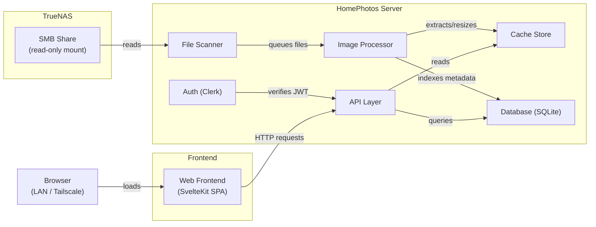

# Architecture

## High-Level System Diagram



## Data Flow

The pipeline from a photo appearing on the SMB share to a user viewing it in the browser:

1. **Discovery.** The file scanner walks the SMB mount point on a schedule (or on-demand trigger by the admin). It compares the filesystem state against the database to find new, modified, or deleted files.

2. **Queuing.** New and modified files are added to a processing queue. The queue is processed with bounded concurrency to avoid overwhelming the NAS or the server's memory.

3. **Image processing.** For each queued file:
   - **ARW files:** LibRaw's `unpack_thumb()` extracts the embedded full-resolution JPEG. This is orders of magnitude faster than decoding the Bayer sensor data. The extracted JPEG is used as the source for all downstream resizing.
   - **JPEG / PNG / TIFF files:** Read directly as the source image.

4. **Thumbnail and preview generation.** From the source image (extracted JPEG or original file):
   - A **thumbnail** is generated at 300px on the longest edge. Used in grid views.
   - A **preview** is generated at 1600px on the longest edge. Used in the detail/lightbox view.
   - Both are saved as JPEG to the cache directory.

5. **Metadata extraction.** EXIF data is parsed from the original file and stored in SQLite: camera model, lens, focal length, aperture, shutter speed, ISO, date/time, GPS coordinates, image dimensions.

6. **Indexing.** The file path, content hash, processing status, and metadata foreign keys are recorded in SQLite.

7. **Serving.** When a user requests a photo through the API, the server reads the cached thumbnail or preview from disk and serves it over HTTP. The original file on the SMB share is never served directly to the client.

## Read-Only Contract

HomePhotos treats the photo library as immutable. This is enforced at multiple layers:

| Layer | Mechanism |
|-------|-----------|
| **OS mount** | The SMB share is mounted with read-only flags (`-o ro`). The operating system will reject any write syscall to the mount point. |
| **Docker volume** | In Docker Compose, the SMB volume is mounted as `:ro`. Docker enforces this independently of the OS mount. |
| **Application code** | The source path is used exclusively with read operations (`os.Open`, `io.ReadSeeker`). No code path exists that writes to the source directory. Path validation ensures that cache writes cannot escape to the source tree. |
| **Principle** | Originals are managed by Lightroom. HomePhotos is a downstream consumer. If the cache is lost, it can be fully regenerated from the originals. |

The cache directory is entirely separate from the source mount. It is mounted read-write and contains only derived data (thumbnails, previews). Deleting the cache is always safe -- the next scan will regenerate it.

## Network Topology

```
┌─────────────────────────────────────────────────┐
│                   Home LAN                      │
│                                                 │
│  ┌───────────┐        ┌──────────────────────┐  │
│  │  TrueNAS  │──SMB──>│  HomePhotos Server   │  │
│  │  (NAS)    │        │  (Docker container   │  │
│  │           │        │   or bare metal)     │  │
│  └───────────┘        └──────────┬───────────┘  │
│                                  │              │
│                                  │ HTTP         │
│                                  │              │
│                       ┌──────────┴───────────┐  │
│                       │  LAN Clients         │  │
│                       │  (Mac, iPad, etc.)   │  │
│                       └──────────────────────┘  │
└──────────────────────────┬──────────────────────┘
                           │
                    Tailscale (WireGuard)
                           │
                ┌──────────┴──────────┐
                │  Remote Clients     │
                │  (phone on cell,    │
                │   laptop on travel) │
                └─────────────────────┘
```

- **TrueNAS** serves the photo library over SMB on the local network.
- **HomePhotos Server** runs on the same LAN -- either as a Docker container on TrueNAS itself, or on a separate machine. It mounts the SMB share read-only.
- **LAN clients** access the web UI directly over HTTP on the local network.
- **Remote clients** connect via Tailscale. Tailscale assigns each device a stable IP on a private mesh network. No ports are opened on the router. No DNS or TLS configuration is required (Tailscale can optionally provide HTTPS via MagicDNS).
- **No public internet exposure.** The HomePhotos server is never reachable from the public internet.

## Key Architectural Decisions

### File scanning instead of an upload endpoint

Photos already exist on the NAS, managed by Lightroom. An upload endpoint would mean duplicating files or introducing a second import path. Instead, HomePhotos scans the existing filesystem, treating the NAS as the single source of truth. This keeps the workflow simple: import in Lightroom, trigger a scan (or wait for the scheduled scan), and the photos appear in HomePhotos.

### Embedded JPEG extraction over full RAW decoding

Sony ARW files from the A7RV embed a full-resolution JPEG (approximately 60 megapixels) inside the RAW container. Extracting this embedded JPEG with `unpack_thumb()` takes milliseconds. A full RAW decode (demosaicing the Bayer data, applying color profiles, tone mapping) takes seconds per file and requires significant memory. Since HomePhotos is a viewer -- not an editor -- the embedded JPEG is more than sufficient for generating thumbnails and previews. This decision reduces processing time for a large library from hours to minutes.

### SQLite as the database

SQLite is a single-file database that requires no separate service, no network configuration, and no authentication setup. It is well-suited for a 1-5 user application with a single writer (the scanner/indexer) and multiple readers (the API serving web requests). It also has a convenient symmetry with Lightroom Classic, which stores its catalog as a SQLite database -- this simplifies the stretch goal of catalog integration. Backups are as simple as copying a single file.

### Clerk for authentication

Building authentication from scratch (password hashing, session management, token refresh, account recovery, login UI) is a significant undertaking that is tangential to the core purpose of HomePhotos. Clerk provides a managed authentication service with pre-built UI components, JWT-based sessions, and user management. For a family app with a handful of users, the free tier is more than sufficient. The tradeoff is a dependency on an external service, but the time saved is substantial.
